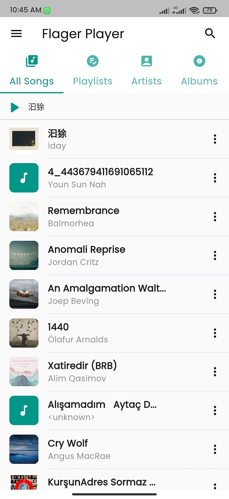
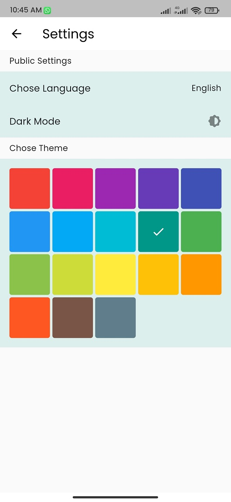
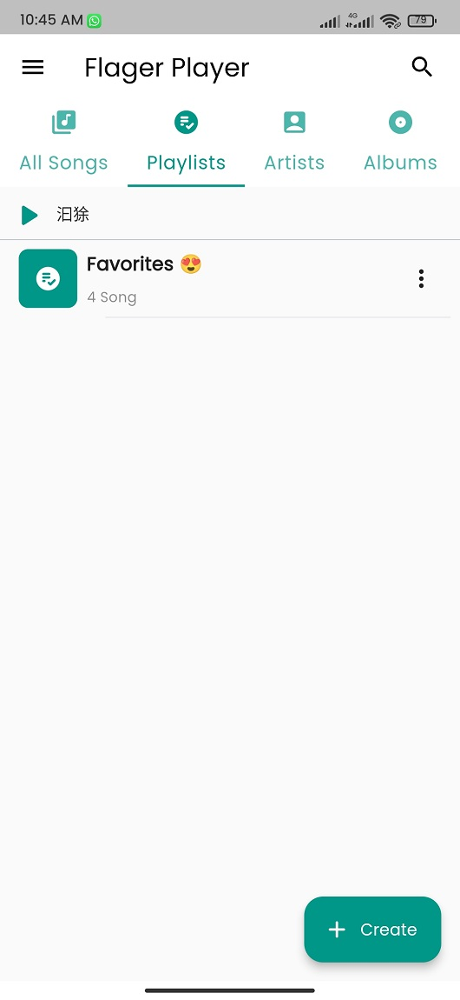
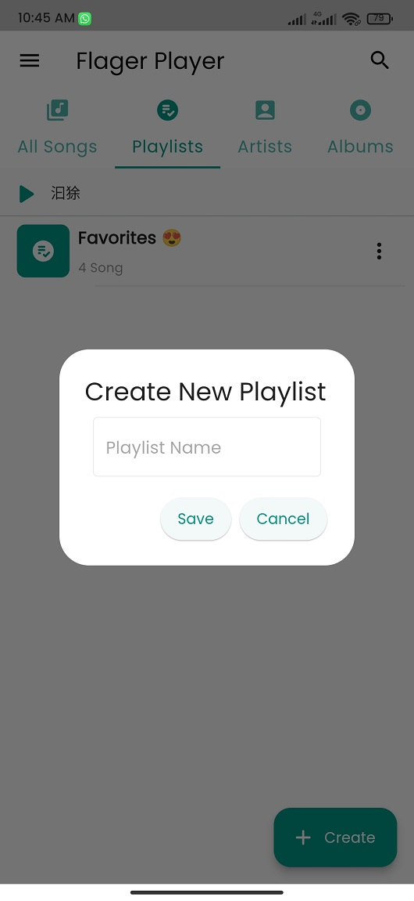
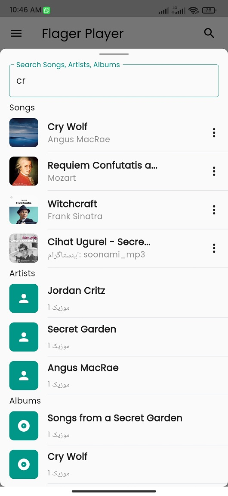
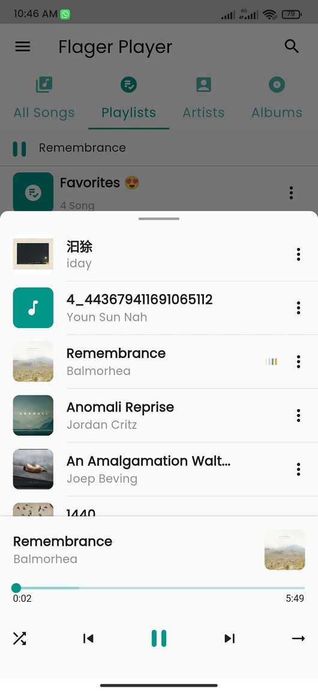
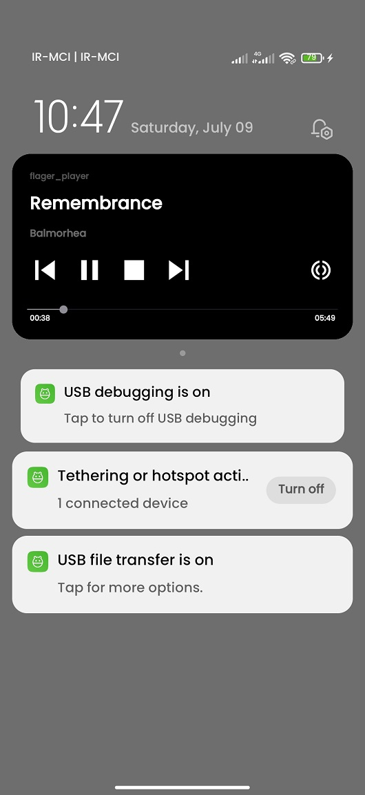

# Flager Music Player

Open Source Flutter Music Player(Read Local Storage Songs.)

# Music Player App

[Download From Google Drive](https://drive.google.com/file/d/13V0_wjZKPa7UTOpKfJiDHT6N0GaEN_pR/view?usp=sharing)

## Features

* [x] Android

    * [x] Fetch local songs
    * [x] Multiple themes
    * [x] Play
    * [x] Stop
    * [x] Pause
    * [x] Seek
    * [x] Shuffle
    * [x] Album Art
    * [x] Duration / Position
    * [x] Create/Remove/Rename playlist
    * [x] Add/Remove song to playlist
    * [x] Search On Songs/Artists/Albums
    * [x] Notification Service
    

### Screenshots

 
 
 
 
 
 
 

